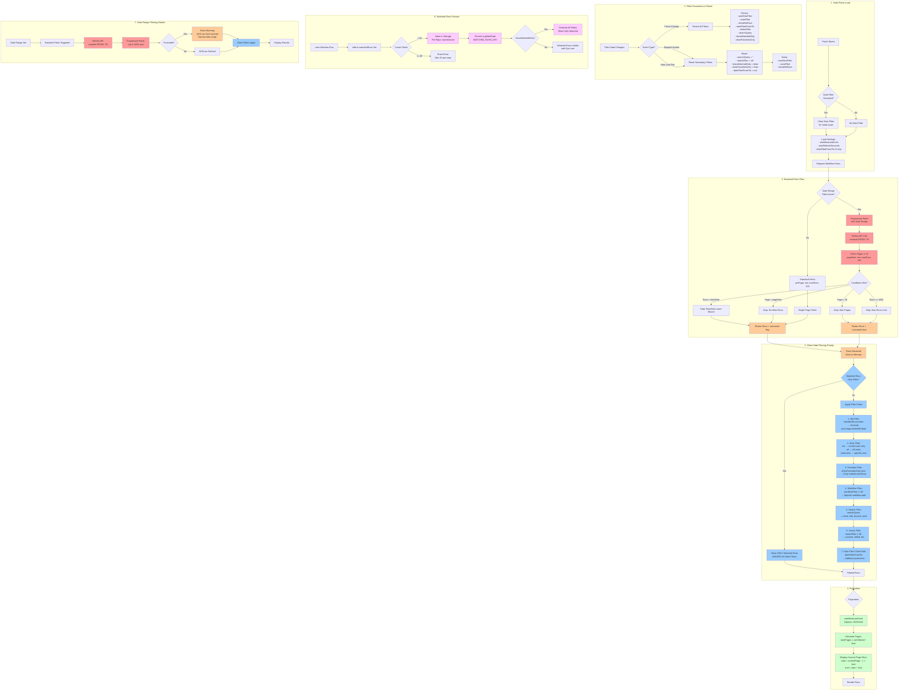

# Workflow Runs Fetching and Filtering Architecture

> **Complete guide to the workflow runs system with visual diagrams and detailed explanations**

## Table of Contents

- [Overview](#overview)
- [Visual Architecture](#visual-architecture)
  - [Architecture Flowchart](#architecture-flowchart)
  - [Sequence Diagram](#sequence-diagram)
- [Architecture Components](#architecture-components)
- [Fetching Strategy](#fetching-strategy)
- [Filtering Strategy](#filtering-strategy)
- [Pagination](#pagination)
- [Filter Persistence](#filter-persistence)
- [Watched Runs Feature](#watched-runs-feature)
- [Best Practices](#best-practices)
- [Troubleshooting](#troubleshooting)

---

## Overview

The Workflow Runs panel implements a sophisticated **two-tier filtering system** that combines:

1. **Backend (API-level) filtering**: Date range filtering via GitHub API
2. **Client-side filtering**: All other filters applied in-memory

### Key Features

- ⚡ **Progressive Fetching**: Automatically fetches up to 1000 runs across multiple pages
- 🎯 **Hybrid Filtering**: Date range at API level, everything else client-side
- 💾 **Smart Caching**: Workflow-specific caching with automatic invalidation
- 📄 **Configurable Pagination**: 20/50/100 runs per page
- 👁️ **Watched Runs**: Track up to 20 important runs per repository
- 🔄 **Filter Persistence**: Maintains state across sessions with smart reset logic

---

## Visual Architecture

### Architecture Flowchart

This diagram shows the complete system with 7 main sections: Initial Load, Backend Fetch, Client-Side Filtering, Pagination, Filter Persistence, Watched Runs, and Date Range Details.



**Color Legend:**

- 🔴 **Red**: Backend/API operations
- 🟠 **Orange**: Data transfer/storage
- 🔵 **Blue**: Client-side filtering
- 🟢 **Green**: Pagination logic
- 🟣 **Purple**: Watched runs feature

---

### Sequence Diagram

This diagram shows the interaction flow between components throughout the lifecycle of fetching and filtering workflow runs.

```mermaid
sequenceDiagram
    participant User
    participant Webview
    participant Backend
    participant GitHub API
    participant Storage

    Note over User,Storage: 1. Initial Load Sequence
    User->>Webview: Open Workflow Runs Panel
    Webview->>Backend: Request Initial Settings
    Backend->>Storage: Get Persisted Settings
    Storage-->>Backend: workflowLoadLimit, dateFilterFrom/To
    Note over Backend: CRITICAL: Clear date filters<br/>for initial load to avoid<br/>empty results
    Backend-->>Webview: Settings (date filters for UI only)
    Webview->>Backend: getWorkflowRuns()

    alt No Date Filter Active
        Backend->>GitHub API: GET /actions/runs?per_page=100&page=1
        GitHub API-->>Backend: Runs (single page)
    else Date Filter Active
        Backend->>GitHub API: GET /actions/runs?created=FROM..TO&per_page=100&page=1
        GitHub API-->>Backend: Page 1 runs
        loop Progressive Fetch (up to 10 pages or 1000 runs)
            alt More runs needed
                Backend->>GitHub API: GET /actions/runs?created=FROM..TO&page=N
                GitHub API-->>Backend: Page N runs
            end
            alt Stop Condition Met
                Note over Backend: Stop if:<br/>- Runs older than fromDate<br/>- Page < pageSize<br/>- Page = 10<br/>- Total runs >= 1000
            end
        end
        Note over Backend: Set truncated=true if<br/>stopped at page 10 or 1000 runs
    end

    Backend-->>Webview: Runs + totalCount + truncated flag

    Note over User,Storage: 2. Client-Side Filtering
    Webview->>Webview: Store runs in memory

    alt Watched Runs Only Filter Active
        Webview->>Webview: Filter: runs.filter(r => watchedRuns.has(r.id))
        Note over Webview: IGNORE all other filters
    else Normal Filter Chain
        Webview->>Webview: 1. Bot Filter (if !showBotRuns)
        Webview->>Webview: 2. Actor Filter (me/all/username)
        Webview->>Webview: 3. Favorites Filter (if showFavoritesOnly)
        Webview->>Webview: 4. Workflow Filter (if not 'all')
        Webview->>Webview: 5. Search Filter (if searchQuery)
        Webview->>Webview: 6. Status Filter (if not 'all')
        Webview->>Webview: 7. Date Filter (client-side precision)
    end

    Webview->>Webview: Apply Pagination (workflowLoadLimit)
    Webview->>User: Display Filtered Runs

    Note over User,Storage: 3. Date Range Filter Change
    User->>Webview: Set Date Range Filter
    Webview->>Webview: Clear cache, reset pagination
    Webview->>Backend: updateDateFilter({from, to})
    Backend->>Storage: Persist Date Filter
    Backend->>GitHub API: GET /actions/runs?created=FROM..TO
    Note over Backend,GitHub API: Progressive fetch with<br/>date range (up to 1000 runs)
    GitHub API-->>Backend: Runs + truncated flag
    Backend-->>Webview: Runs + truncated flag

    alt Truncated = true
        Webview->>User: Show Warning: 1000 run limit reached
    end

    Webview->>Webview: Apply Client-Side Filters
    Webview->>User: Display Filtered Results

    Note over User,Storage: 4. Workflow Dispatch / View Last Run
    User->>Webview: Dispatch Workflow / View Last Run
    Webview->>Webview: Reset Secondary Filters:<br/>- searchQuery = ''<br/>- statusFilter = 'all'<br/>- showWatchedOnly = false<br/>- showFavoritesOnly = false<br/>- dateFilterFrom/To = null
    Webview->>Webview: Keep Primary Filters:<br/>- workflowFilter<br/>- actorFilter<br/>- showBotRuns
    Webview->>Backend: getWorkflowRuns (no date filter)
    Backend->>GitHub API: GET /actions/runs
    GitHub API-->>Backend: Runs
    Backend-->>Webview: Runs
    Webview->>User: Display Results

    Note over User,Storage: 5. Watch Run Feature
    User->>Webview: Toggle Watch on Run
    Webview->>Webview: Add/Remove from watchedRuns Set
    Webview->>Backend: toggleRunWatch({runId, isWatched})
    Backend->>Storage: Get Watched Runs for Repo
    Storage-->>Backend: Current watched runs array

    alt Adding Watch
        alt Count < 20
            Backend->>Storage: Add runId to watched array
            Storage-->>Backend: Success
            Backend-->>Webview: Success
            Webview->>User: Toast: "Watching run #N"
        else Count >= 20
            Backend-->>Webview: Error: Max 20 per repo
            Webview->>User: Show Error Message
        end
    else Removing Watch
        Backend->>Storage: Remove runId from watched array
        Storage-->>Backend: Success
        Backend-->>Webview: Success
        Webview->>User: Toast: "Stopped watching run #N"
    end

    Note over User,Storage: 6. Filter Persistence
    User->>Webview: Change Filter
    Webview->>Webview: Apply Filter
    Webview->>Backend: Update Filter State
    Backend->>Storage: Persist Filter State
    Note over Storage: Persisted across sessions:<br/>- workflowLoadLimit<br/>- dateFilterFrom/To<br/>- All filter states
```



---

## Architecture Components

### 1. Backend Provider

**File**: `src/providers/workflow-runs-panel.ts`

Manages communication between VS Code extension and webview, orchestrates GitHub API calls, and handles filter state persistence.

**Key Methods:**

- `_sendWorkflowRuns()`: Main entry point for fetching runs
- `_fetchRunsSinceDate()`: Progressive fetching with date range filters (lines 1233-1426)
- `_sendInitialSettings()`: Loads persisted settings with date filter clearing (lines 792-805)

### 2. GitHub API Layer

**File**: `src/api/workflow-monitor.ts`

Handles direct communication with GitHub Actions API.

**Key Function**: `getWorkflowRuns()` (lines 23-113)

- Supports `created` parameter for server-side date filtering
- Returns runs with `totalCount` and optional `truncated` flag
- Intentionally avoids branch/actor/status query parameters (GitHub API bugs)

### 3. Webview Component

**File**: `webview/WorkflowRuns.svelte`

Svelte-based UI component that displays runs and applies client-side filters.

**Key Functions:**

- `applyFiltersToRuns()`: Applies the 7-step filter chain (lines 2065-2195)
- `filterRuns()`: Main filtering orchestrator
- `handleDateFilterFromChange()` / `handleDateFilterToChange()`: Triggers backend refetch (lines 452-526)

### 4. Storage Layer

**File**: `src/utils/storage.ts`

Persists state across sessions using VS Code's global state.

**Key Storage:**

- `WORKFLOW_RUNS_PANEL_SETTINGS_KEY`: Panel configuration (lines 16-26)
- `WATCHED_RUNS_KEY`: Map of repo → watched run IDs (lines 488-613)
- `MAX_WATCHED_RUNS_PER_REPO = 20`: Constant limit (line 19)

---

## Fetching Strategy

### Initial Load Behavior

When the Workflow Runs panel opens:

1. **Load Persisted Settings** from Storage
2. **🚨 CRITICAL**: Clear date filters for initial load
   - Prevents empty results if persisted date range has no runs
   - Date filter values are sent to UI but NOT applied to API call
3. **Fetch Runs** without date filter (most recent runs)

```typescript
// Lines 792-805: Critical fix to clear date filters on initial load
this._currentDateFilterFrom = null;
this._currentDateFilterTo = null;
console.log(
  '[WorkflowRunsPanel] _sendInitialSettings: Cleared date filters for initial load.',
  'Persisted values (sent to webview but not applied):',
  { dateFilterFrom, dateFilterTo }
);
```

### Standard Fetch (No Date Filter)

When no date filter is active:

- Single API call: `GET /repos/{owner}/{repo}/actions/runs?per_page=100&page=1`
- Returns most recent runs (up to 100)
- Fast and efficient for typical use cases

### Progressive Fetch (Date Filter Active)

When date range filter is set, the system performs **progressive fetching**:

1. **Server-Side Filtering**: Pass `created=FROM..TO` to GitHub API
2. **Progressive Pagination**: Fetch pages 1-10 sequentially
3. **Stop Conditions**:
   - ✅ Runs older than `fromDate` (reached lower bound)
   - ✅ Page returned fewer runs than requested (no more data)
   - ✅ Reached page 10 (max pages limit)
   - ✅ Collected 1000 runs (max runs limit)

```typescript
// Lines 47-62: GitHub API date filter implementation
if (options.createdFrom || options.createdTo) {
  const fromStr = options.createdFrom ? options.createdFrom.toISOString() : '*';
  const toStr = options.createdTo ? options.createdTo.toISOString() : '*';
  const createdRange = `${fromStr}..${toStr}`;
  params.append('created', createdRange);
}
```

### Why Date Filters Are Cleared on Initial Load

**Problem**: Persisted date filters from previous sessions can result in zero runs if:

- The date range is in the past with no matching runs
- The workflow hasn't run during that period
- User forgot they had a date filter active

**Solution**: Always start with no date filter, showing the most recent runs. Users can explicitly apply date filters if needed.

### The 1000-Run Limit

**Rationale:**

- Prevents excessive API calls (10 pages × 100 runs = 1000 max)
- Balances completeness with performance
- Respects GitHub API rate limits (5000 requests/hour)

**Behavior When Exceeded:**

- `truncated: true` flag is set
- Webview displays warning message (unless "Watched Runs Only" filter is active)
- User is prompted to narrow the date range

**Note:** The warning message is suppressed when "Watched Runs Only" filter is active because watched runs are tracked by specific run IDs (max 20 per repository), making the 1000-run fetch limit irrelevant in that context.

---

## Filtering Strategy

### Two-Tier Architecture

```
┌─────────────────────────────────────────────────────────────┐
│                    BACKEND (API-LEVEL)                      │
│  Date Range Filtering: created=FROM..TO                    │
│  • Handles high-volume workflows (1000+ runs/day)          │
│  • Progressive fetch up to 1000 runs                       │
└─────────────────────────────────────────────────────────────┘
                            ↓
┌─────────────────────────────────────────────────────────────┐
│                  CLIENT-SIDE (WEBVIEW)                      │
│  7-Step Filter Chain:                                       │
│  1. Bot Filter                                              │
│  2. Actor Filter                                            │
│  3. Favorites Filter                                        │
│  4. Workflow Filter                                         │
│  5. Search Filter                                           │
│  6. Status Filter                                           │
│  7. Date Filter (precision)                                 │
└─────────────────────────────────────────────────────────────┘
```

### Backend (API-Level) Filtering

**Date Range Only**: The only filter sent to GitHub API

**Why?**

- GitHub Actions API has known reliability issues with other filters (branch, actor, status)
- These filters often return incomplete or empty results
- Date filtering is reliable and critical for high-volume workflows

### Client-Side Filtering: The 7-Step Chain

All runs fetched from the API are stored in memory and filtered client-side:

#### Step 1: Bot Filter

```typescript
// Lines 2097-2099
if (!skipBot && !showBotRuns) {
  filtered = filtered.filter((run) => !run.actor.login.endsWith('[bot]'));
}
```

- **Default**: Exclude bot runs
- **When enabled**: Show runs triggered by bot accounts (e.g., `dependabot[bot]`)

#### Step 2: Actor Filter

```typescript
// Lines 2102-2110
if (actorFilter === 'me' && currentUsername) {
  filtered = filtered.filter((run) => run.actor.login === currentUsername);
} else if (actorFilter !== 'all' && actorFilter !== 'me') {
  filtered = filtered.filter((run) => run.actor.login === actorFilter);
}
```

- **Options**: `all`, `me`, or specific username
- **Default**: `me` (current user's runs only)

#### Step 3: Favorites Filter

- **When enabled**: Show only runs from workflows marked as favorites
- **Storage**: Persisted in `MARKED_WORKFLOWS_KEY`

#### Step 4: Workflow Filter

- **Options**: `all` or specific workflow path
- **Use case**: Focus on a single workflow's runs

#### Step 5: Search Filter

```typescript
// Lines 2131-2140
if (!skipSearch && searchQuery.trim()) {
  const query = searchQuery.toLowerCase();
  filtered = filtered.filter(
    (run) =>
      run.name.toLowerCase().includes(query) ||
      run.display_title?.toLowerCase().includes(query) ||
      run.head_branch.toLowerCase().includes(query) ||
      run.actor.login.toLowerCase().includes(query)
  );
}
```

- **Searches**: Workflow name, display title, branch name, actor username
- **Case-insensitive**

#### Step 6: Status Filter

- **Options**: `all`, `success`, `failed`, `in_progress`, `queued`, `cancelled`

#### Step 7: Date Filter (Client-Side Precision)

- **Purpose**: Additional precision beyond API-level filtering
- **Handles edge cases**: Where GitHub API may return incomplete results

### Special Case: "Watched Runs Only" Filter

**Overrides ALL other filters:**

```typescript
// Lines 2083-2094
if (showWatchedOnly && !skipWatchedOnly && watchedRuns.size > 0) {
  const watchedFiltered = runs.filter((run) => watchedRuns.has(run.id));
  console.log(
    '[WorkflowRuns] Watched-only mode: showing',
    watchedFiltered.length,
    'watched runs out of',
    runs.length,
    'total runs. Watched IDs:',
    Array.from(watchedRuns)
  );
  return watchedFiltered;
}
```

**Behavior:**

- When enabled, ONLY watched runs are shown
- All other filters (status, actor, workflow, search, etc.) are ignored
- Useful for tracking specific important runs

---

## Pagination

### Configurable Per-Page Limits

Users can select page size from the settings:

- **20 runs per page** (default)
- **50 runs per page**
- **100 runs per page**

### Pagination Logic

```typescript
const totalPages = Math.ceil(filteredRuns.length / workflowLoadLimit);
const start = (currentPage - 1) * workflowLoadLimit;
const end = start + workflowLoadLimit;
const displayedRuns = filteredRuns.slice(start, end);
```

**Key Points:**

- Pagination is applied AFTER all filters
- Page size persists across sessions
- Current page resets when filters change

---

## Filter Persistence

### Filters That Persist Across Sessions

All filter states are persisted in VS Code's global state:

```typescript
// Persisted filters:
-workflowFilter -
  actorFilter -
  showBotRuns -
  dateFilterFrom -
  dateFilterTo -
  statusFilter -
  searchQuery -
  showWatchedOnly -
  showFavoritesOnly -
  workflowLoadLimit;
```

### Filter Reset Logic

**When filters are reset:**

- After workflow dispatch action
- After "View Last Run" action

**What gets reset (Secondary Filters):**

```typescript
// Lines 1752-1759
searchQuery = '';
statusFilter = 'all';
showWatchedOnly = false;
showFavoritesOnly = false;

if (dateFilterFrom || dateFilterTo) {
  clearDateFilter();
}
```

**What persists (Primary Filters):**

```typescript
// These are NOT reset:
-workflowFilter - actorFilter - showBotRuns;
```

**Rationale:**

- After dispatching a workflow, users typically want to see that specific workflow's runs
- Secondary filters (search, status, date range) are cleared to show all runs for that workflow
- Primary filters (workflow, actor, bot runs) are kept to maintain context

---

## Watched Runs Feature

### Overview

Users can "watch" up to 20 workflow runs per repository to track important runs.

### Storage Mechanism

```typescript
// Line 31
type WatchedRunsMap = Record<string, number[]>;

// Storage key format: "owner/repo" → [runId1, runId2, ...]
const key = `${owner}/${repo}`;
```

### 20-Run Limit Per Repository

**Enforcement:**

```typescript
// Lines 518-520
if (watched.length >= MAX_WATCHED_RUNS_PER_REPO) {
  return `You have reached the maximum of ${MAX_WATCHED_RUNS_PER_REPO} watched runs for this repository. Please remove older watched runs to add new ones.`;
}
```

**Why 20?**

- Prevents unbounded growth of stored data
- Encourages users to focus on truly important runs
- Keeps UI manageable

### Integration with Filtering

**Visual Indicator:**

- Watched runs show an eye icon (👁️) in the UI
- Visible regardless of filter state (unless "Watched Runs Only" is active)

**"Watched Runs Only" Filter:**

- When enabled, shows ONLY watched runs
- Overrides all other filters
- Useful for quick access to tracked runs

**Management:**

- Users can view all watched runs in a modal
- Can unwatch individual runs or unwatch all at once
- Watched status persists across sessions

---

## Best Practices

### For Users

1. **Use Date Filters for Old Runs**: If you need to find runs from weeks/months ago, use date range filters
2. **Narrow Date Ranges**: If you see the "1000 run limit" warning, narrow your date range
3. **Watch Important Runs**: Use the watch feature to track critical runs (max 20 per repo)
4. **Clear Filters**: Use "Clear Filters" button if you're not seeing expected runs
5. **Check Applied Filters**: Review the "Applied Filters" section to see what's active

### For Developers

1. **Always Clear Date Filters on Initial Load**: Prevents empty results
2. **Use Progressive Fetching for Date Ranges**: Don't fetch all runs at once
3. **Apply Filters Client-Side**: Except for date ranges (GitHub API unreliability)
4. **Respect the 1000-Run Limit**: Balance completeness with performance
5. **Persist Filter State**: But reset secondary filters after dispatch/view actions
6. **Test with High-Volume Workflows**: Ensure progressive fetching works correctly
7. **Handle Truncation Gracefully**: Show clear warnings when 1000-run limit is reached

---

## Troubleshooting

### No Runs Displayed

**Possible causes:**

1. **Date filter is active with no matching runs** → Clear date filter
2. **Too many filters active** → Check "Applied Filters" section
3. **"Watched Runs Only" is enabled with no watched runs** → Disable the filter
4. **Actor filter set to "me" but no runs from current user** → Change to "all"

**Solution:**

- Click "Clear Filters" button
- Check each filter in the UI
- Verify repository has workflow runs

### "1000 Run Limit Reached" Warning

**Causes:**

- Date range is too wide (e.g., 6+ months for high-volume workflows)
- Workflow runs very frequently (multiple times per day)

**Solutions:**

- Narrow the date range to a shorter period (e.g., last 7 days, last 30 days)
- Use additional filters (workflow, status, actor) to reduce results
- Consider if you really need to see that many runs
- Use "Watched Runs" feature to track specific important runs

### Watched Runs Not Showing

**Possible causes:**

1. **Reached 20-run limit** → Remove old watched runs
2. **Runs are filtered out by other active filters** → Check filter state
3. **Runs are from a different repository** → Watched runs are per-repo
4. **"Watched Runs Only" filter is off** → Enable it to see only watched runs

**Solution:**

- Open "Manage Watched Runs" modal
- Verify watched runs exist for current repository
- Check if other filters are hiding watched runs

### Filters Not Persisting

**Expected behavior:**

- All filters persist across VS Code sessions
- Secondary filters reset after dispatch/view last run actions
- Primary filters (workflow, actor, bot runs) always persist

**If filters aren't persisting:**

- Check VS Code's global state storage
- Verify extension has proper permissions
- Try reloading VS Code window

### Slow Performance with Many Runs

**Causes:**

- Fetching 1000+ runs with progressive fetching
- Client-side filtering on large datasets
- Too many runs displayed per page

**Solutions:**

- Use date range filters to reduce dataset
- Reduce page size (20 instead of 100)
- Use more specific filters (workflow, status, actor)
- Clear browser cache and reload webview

---

## Key Architectural Decisions

### Why Two-Tier Filtering?

**Decision**: Implement date filtering at API level, all other filters client-side

**Rationale:**

1. **GitHub API Reliability**: Branch/actor/status filters are unreliable in GitHub API
2. **Performance**: Date filtering reduces dataset size before client-side processing
3. **Flexibility**: Client-side filtering allows complex filter combinations
4. **User Experience**: Instant filter updates without API calls

### Why Clear Date Filters on Initial Load?

**Decision**: Always clear date filters when panel first opens

**Rationale:**

1. **Avoid Empty Results**: Persisted date ranges may have no runs
2. **User Confusion**: Users forget they had date filters active
3. **Better UX**: Show most recent runs by default
4. **Explicit Intent**: Users must explicitly set date filters

### Why 1000-Run Limit?

**Decision**: Stop progressive fetching at 1000 runs or 10 pages

**Rationale:**

1. **API Rate Limits**: Respect GitHub's 5000 requests/hour limit
2. **Performance**: Balance completeness with speed
3. **Practical Limit**: Most use cases don't need 1000+ runs
4. **User Guidance**: Warning prompts users to narrow date range

### Why 20 Watched Runs Per Repo?

**Decision**: Limit watched runs to 20 per repository

**Rationale:**

1. **Storage Efficiency**: Prevent unbounded growth
2. **UI Manageability**: Keep watched runs list focused
3. **User Behavior**: Encourages tracking truly important runs
4. **Performance**: Fast lookups with small sets

---

## Future Enhancements

Potential improvements to consider:

1. **Incremental Loading**: Load runs as user scrolls instead of pagination
2. **Advanced Search**: Support for complex queries (e.g., "branch:main AND status:failed")
3. **Custom Date Presets**: Quick filters like "Last 7 days", "Last 30 days", "This week"
4. **Export Functionality**: Export filtered runs to CSV/JSON
5. **Run Comparison**: Compare parameters/results between multiple runs
6. **Notification System**: Alert when watched runs complete or fail
7. **Bulk Actions**: Select multiple runs for bulk operations (rerun, cancel, watch)
8. **Filter Presets**: Save and load filter combinations
9. **Run Analytics**: Charts and graphs showing run trends over time
10. **Smart Suggestions**: AI-powered filter suggestions based on usage patterns

---

## Conclusion

The Workflow Runs fetching and filtering system provides a **robust, performant solution** for managing large volumes of GitHub Actions workflow runs.

### Key Strengths

✅ **Hybrid Architecture**: Combines API-level and client-side filtering for optimal performance
✅ **Progressive Fetching**: Handles high-volume workflows efficiently
✅ **Smart Defaults**: Clears date filters on initial load to prevent empty results
✅ **Flexible Filtering**: 7-step filter chain with special "Watched Runs Only" mode
✅ **Persistent State**: Maintains filter state across sessions with smart reset logic
✅ **User-Friendly**: Clear warnings, helpful tooltips, and intuitive UI

### Design Philosophy

The architecture prioritizes:

1. **User Experience**: Fast, responsive, and intuitive
2. **Reliability**: Works around GitHub API limitations
3. **Performance**: Efficient data fetching and filtering
4. **Flexibility**: Powerful filtering without complexity
5. **Maintainability**: Clear separation of concerns

This system successfully handles both **high-volume workflows** (1000+ runs/day) and **complex filtering requirements** while maintaining a responsive user experience.

---

## Related Documentation

- **[Workflow Runs Filtering Guide](./architecture/WORKFLOW_RUNS_FILTERING.md)** - Detailed implementation guide
- **[Architecture Diagrams](./architecture/WORKFLOW_RUNS_ARCHITECTURE_DIAGRAMS.md)** - Standalone diagram file
- **[Main README](../README.md)** - Extension overview and features

---

**Last Updated**: 2025-11-27
**Version**: 1.0
**Maintainer**: VS Code GitHub Workflow Runner Team
