# Workflow Runs Fetching and Filtering Architecture

This document provides visual diagrams of the workflow runs fetching and filtering architecture for the VS Code GitHub Workflow Runner extension.

## Table of Contents

- [Architecture Flowchart](#architecture-flowchart)
- [Sequence Diagram](#sequence-diagram)
- [Color Coding](#color-coding)

## Architecture Flowchart

This diagram shows the complete system architecture with 7 main sections: Initial Load, Backend Fetch Flow, Client-Side Filtering Priority, Pagination, Filter Persistence & Reset, Watched Runs Feature, and Date Range Filtering Details.

```mermaid
graph TB
    subgraph "1. Initial Panel Load"
        A[Panel Opens] --> B{Date Filter<br/>Persisted?}
        B -->|Yes| C[Clear Date Filter<br/>for Initial Load]
        B -->|No| D[No Date Filter]
        C --> E[Load Settings:<br/>- workflowLoadLimit<br/>- autoRefreshSeconds<br/>- dateFilterFrom/To UI only]
        D --> E
        E --> F[Request Workflow Runs]
    end
    
    subgraph "2. Backend Fetch Flow"
        F --> G{Date Range<br/>Filter Active?}
        G -->|Yes| H[Progressive Fetch<br/>with Date Range]
        G -->|No| I[Standard Fetch<br/>perPage: min maxRuns, 100]
        
        H --> J[GitHub API Call<br/>created=FROM..TO]
        J --> K[Fetch Pages 1-10<br/>pageSize: min maxRuns, 100]
        K --> L{Conditions Met?}
        L -->|Runs < fromDate| M[Stop: Reached Lower Bound]
        L -->|Page < pageSize| N[Stop: No More Runs]
        L -->|Page = 10| O[Stop: Max Pages]
        L -->|Runs >= 1000| P[Stop: Max Runs Limit]
        
        M --> Q[Return Runs + truncated flag]
        N --> Q
        O --> R[Return Runs + truncated=true]
        P --> R
        
        I --> S[Single Page Fetch]
        S --> Q
    end
    
    subgraph "3. Client-Side Filtering Priority"
        Q --> T[Runs Received<br/>Store in Memory]
        R --> T
        
        T --> U{Watched Runs<br/>Only Filter?}
        U -->|Yes| V[Show ONLY Watched Runs<br/>IGNORE All Other Filters]
        U -->|No| W[Apply Filter Chain]
        
        W --> X1[1. Bot Filter<br/>showBotRuns=false<br/>→ Exclude actor.login.endsWith '[bot]']
        X1 --> X2[2. Actor Filter<br/>me → current user only<br/>all → all users<br/>username → specific user]
        X2 --> X3[3. Favorites Filter<br/>showFavoritesOnly=true<br/>→ Only marked workflows]
        X3 --> X4[4. Workflow Filter<br/>workflowFilter ≠ 'all'<br/>→ Specific workflow path]
        X4 --> X5[5. Search Filter<br/>searchQuery<br/>→ name, title, branch, actor]
        X5 --> X6[6. Status Filter<br/>statusFilter ≠ 'all'<br/>→ success, failed, etc.]
        X6 --> X7[7. Date Filter Client-Side<br/>dateFilterFrom/To<br/>→ Additional precision]
        
        V --> Y[Filtered Runs]
        X7 --> Y
    end
    
    subgraph "4. Pagination"
        Y --> Z{Pagination}
        Z --> Z1[workflowLoadLimit<br/>Options: 20/50/100]
        Z1 --> Z2[Calculate Pages:<br/>totalPages = ceil filtered / limit]
        Z2 --> Z3[Display Current Page Slice:<br/>start = currentPage - 1 × limit<br/>end = start + limit]
        Z3 --> Z4[Render Runs]
    end
    
    subgraph "5. Filter Persistence & Reset"
        AA[Filter State Changes] --> AB{Event Type?}
        AB -->|Focus Change| AC[Persist All Filters]
        AB -->|Dispatch Action| AD[Reset Secondary Filters]
        AB -->|View Last Run| AD
        
        AC --> AE[Persist:<br/>- workflowFilter<br/>- actorFilter<br/>- showBotRuns<br/>- dateFilterFrom/To<br/>- statusFilter<br/>- searchQuery<br/>- showWatchedOnly<br/>- showFavoritesOnly]
        
        AD --> AF[Reset:<br/>- searchQuery = ''<br/>- statusFilter = 'all'<br/>- showWatchedOnly = false<br/>- showFavoritesOnly = false<br/>- dateFilterFrom/To = null]
        AF --> AG[Keep:<br/>- workflowFilter<br/>- actorFilter<br/>- showBotRuns]
    end
    
    subgraph "6. Watched Runs Feature"
        BA[User Watches Run] --> BB[Add to watchedRuns Set]
        BB --> BC{Count Check}
        BC -->|< 20| BD[Store in Storage<br/>Per Repo: owner/name]
        BC -->|>= 20| BE[Show Error:<br/>Max 20 per repo]
        
        BD --> BF[Persist to globalState<br/>WATCHED_RUNS_KEY]
        BF --> BG{showWatchedOnly?}
        BG -->|Yes| BH[Override All Filters<br/>Show Only Watched]
        BG -->|No| BI[Watched Runs Visible<br/>with Eye Icon]
    end
    
    subgraph "7. Date Range Filtering Details"
        CA[Date Range Set] --> CB[Backend Fetch Triggered]
        CB --> CC[GitHub API:<br/>created=FROM..TO]
        CC --> CD[Progressive Fetch:<br/>Up to 1000 runs]
        CD --> CE{Truncated?}
        CE -->|Yes| CF[Show Warning:<br/>1000 run limit reached<br/>Narrow date range]
        CE -->|No| CG[All Runs Fetched]
        
        CF --> CH[Client Filters Apply]
        CG --> CH
        CH --> CI[Display Results]
    end
    
    style H fill:#ff9999
    style J fill:#ff9999
    style K fill:#ff9999
    style Q fill:#ffcc99
    style R fill:#ffcc99
    style T fill:#ffcc99
    style U fill:#99ccff
    style V fill:#99ccff
    style W fill:#99ccff
    style X1 fill:#99ccff
    style X2 fill:#99ccff
    style X3 fill:#99ccff
    style X4 fill:#99ccff
    style X5 fill:#99ccff
    style X6 fill:#99ccff
    style X7 fill:#99ccff
    style Z1 fill:#ccffcc
    style Z2 fill:#ccffcc
    style Z3 fill:#ccffcc
    style BD fill:#ffccff
    style BF fill:#ffccff
    style BH fill:#ffccff
    style CC fill:#ff9999
    style CD fill:#ff9999
    style CF fill:#ffcc99
    style CH fill:#99ccff
```

## Sequence Diagram

This diagram shows the interaction flow between User, Webview, Backend, GitHub API, and Storage components throughout the lifecycle of fetching and filtering workflow runs.

```mermaid
sequenceDiagram
    participant User
    participant Webview
    participant Backend
    participant GitHub API
    participant Storage
    
    Note over User,Storage: Initial Load Sequence
    User->>Webview: Open Workflow Runs Panel
    Webview->>Backend: Request Initial Settings
    Backend->>Storage: Get Persisted Settings
    Storage-->>Backend: workflowLoadLimit, dateFilterFrom/To
    Note over Backend: CRITICAL: Clear date filters<br/>for initial load to avoid<br/>empty results
    Backend-->>Webview: Settings (date filters for UI only)
    Webview->>Backend: getWorkflowRuns
    
    alt No Date Filter Active
        Backend->>GitHub API: GET /actions/runs?per_page=100&page=1
        GitHub API-->>Backend: Runs (single page)
    else Date Filter Active
        Backend->>GitHub API: GET /actions/runs?created=FROM..TO&per_page=100&page=1
        GitHub API-->>Backend: Page 1 runs
        loop Progressive Fetch (up to 10 pages or 1000 runs)
            alt More runs needed
                Backend->>GitHub API: GET /actions/runs?created=FROM..TO&page=N
                GitHub API-->>Backend: Page N runs
            end
            alt Stop Condition Met
                Note over Backend: Stop if:<br/>- Runs older than fromDate<br/>- Page < pageSize<br/>- Page = 10<br/>- Total runs >= 1000
            end
        end
        Note over Backend: Set truncated=true if<br/>stopped at page 10 or 1000 runs
    end
    
    Backend-->>Webview: Runs + totalCount + truncated flag
    
    Note over User,Storage: Client-Side Filtering
    Webview->>Webview: Store runs in memory
    
    alt Watched Runs Only Filter Active
        Webview->>Webview: Filter: runs.filter(r => watchedRuns.has(r.id))
        Note over Webview: IGNORE all other filters
    else Normal Filter Chain
        Webview->>Webview: 1. Bot Filter (if !showBotRuns)
        Webview->>Webview: 2. Actor Filter (me/all/username)
        Webview->>Webview: 3. Favorites Filter (if showFavoritesOnly)
        Webview->>Webview: 4. Workflow Filter (if not 'all')
        Webview->>Webview: 5. Search Filter (if searchQuery)
        Webview->>Webview: 6. Status Filter (if not 'all')
        Webview->>Webview: 7. Date Filter (client-side precision)
    end
    
    Webview->>Webview: Apply Pagination (workflowLoadLimit)
    Webview->>User: Display Filtered Runs
    
    Note over User,Storage: Date Range Filter Change
    User->>Webview: Set Date Range Filter
    Webview->>Webview: Clear cache, reset pagination
    Webview->>Backend: updateDateFilter {from, to}
    Backend->>Storage: Persist Date Filter
    Backend->>GitHub API: GET /actions/runs?created=FROM..TO
    Note over Backend,GitHub API: Progressive fetch with<br/>date range (up to 1000 runs)
    GitHub API-->>Backend: Runs + truncated flag
    Backend-->>Webview: Runs + truncated flag
    
    alt Truncated = true
        Webview->>User: Show Warning: 1000 run limit reached
    end
    
    Webview->>Webview: Apply Client-Side Filters
    Webview->>User: Display Filtered Results
    
    Note over User,Storage: Workflow Dispatch / View Last Run
    User->>Webview: Dispatch Workflow / View Last Run
    Webview->>Webview: Reset Secondary Filters:<br/>- searchQuery = ''<br/>- statusFilter = 'all'<br/>- showWatchedOnly = false<br/>- showFavoritesOnly = false<br/>- dateFilterFrom/To = null
    Webview->>Webview: Keep Primary Filters:<br/>- workflowFilter<br/>- actorFilter<br/>- showBotRuns
    Webview->>Backend: getWorkflowRuns (no date filter)
    Backend->>GitHub API: GET /actions/runs
    GitHub API-->>Backend: Runs
    Backend-->>Webview: Runs
    Webview->>User: Display Results
    
    Note over User,Storage: Watch Run Feature
    User->>Webview: Toggle Watch on Run
    Webview->>Webview: Add/Remove from watchedRuns Set
    Webview->>Backend: toggleRunWatch {runId, isWatched}
    Backend->>Storage: Get Watched Runs for Repo
    Storage-->>Backend: Current watched runs array
    
    alt Adding Watch
        alt Count < 20
            Backend->>Storage: Add runId to watched array
            Storage-->>Backend: Success
            Backend-->>Webview: Success
            Webview->>User: Toast: "Watching run #N"
        else Count >= 20
            Backend-->>Webview: Error: Max 20 per repo
            Webview->>User: Show Error Message
        end
    else Removing Watch
        Backend->>Storage: Remove runId from watched array
        Storage-->>Backend: Success
        Backend-->>Webview: Success
        Webview->>User: Toast: "Stopped watching run #N"
    end
    
    Note over User,Storage: Filter Persistence
    User->>Webview: Change Filter
    Webview->>Webview: Apply Filter
    Webview->>Backend: Update Filter State
    Backend->>Storage: Persist Filter State
    Note over Storage: Persisted across sessions:<br/>- workflowLoadLimit<br/>- dateFilterFrom/To<br/>- All filter states
```



## Color Coding

The architecture flowchart uses color coding to distinguish between different types of operations:

- 🔴 **Red (#ff9999)**: Backend/API operations that interact with GitHub API
- 🟠 **Orange (#ffcc99)**: Data transfer and storage operations
- 🔵 **Blue (#99ccff)**: Client-side filtering operations
- 🟢 **Green (#ccffcc)**: Pagination logic
- 🟣 **Purple (#ffccff)**: Watched runs feature

## Related Documentation

- [Workflow Runs Filtering Guide](./WORKFLOW_RUNS_FILTERING.md) - Comprehensive explanation of the filtering system
- [API Documentation](../api/workflow-monitor.md) - GitHub API integration details
- [Storage Documentation](../storage/README.md) - Persistence layer details

